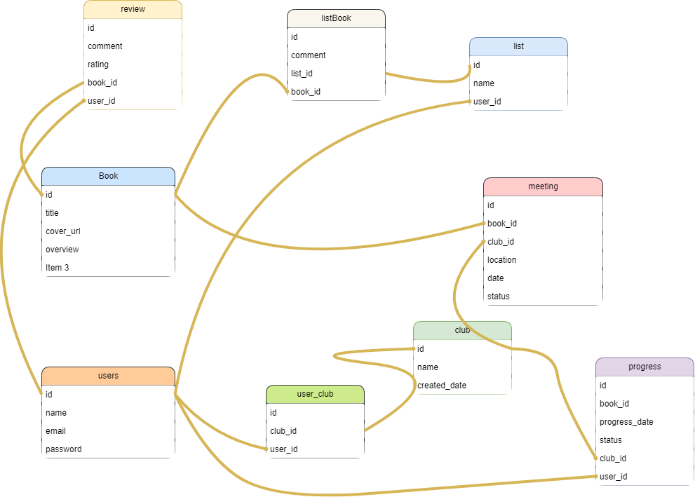

# README

### Introduction & Objectives
This book club application is designed to provide an interactive and user-friendly experience for those who love to read and share their passion for books with others. The app incorporates multi-model relationships, including a many-to-many connection, to facilitate key features such as joining or creating book clubs, tracking reading progress, writing reviews, and organizing club meetings. Users can also create personalized book lists and add favorite titles, making this app a comprehensive tool for book enthusiasts.

### Schema

### User Features
View and manage all book clubs the user is a member of.
Create new book clubs and invite other users.
Access detailed information about specific clubs, including members and upcoming meetings.
Join existing clubs to participate in book discussions and activities.
Create and maintain book lists to organize favorite reads.
Add books to these lists as favorites.
Write and read reviews for books.
Track individual reading progress within a book club setting.

Club Management 📚
Users can explore and manage clubs, view club details, and create new clubs using a streamlined form. Each club page includes member details and upcoming meetings, fostering community interaction.

#### Meetings 📅
Organize and participate in meetings with information on selected books, location, and time. View all meetings on club pages to stay updated.

#### Book Lists and Favorites ⭐
Create, manage, and personalize book lists. Add or remove books as favorites to curate collections tailored to user preferences.

#### User Experience 🧭
The app features a user-friendly interface with quick access to:

Clubs: Browse and create clubs.
Lists: Manage personalized book collections.
Meetings: Schedule and view club events.
Reviews: Leave and read book feedback.
The navigation is designed for intuitive use, ensuring users can engage easily with all book-related activities and connect with fellow readers.

##

This README would normally document whatever steps are necessary to get the
application up and running.

Things you may want to cover:

* Ruby version

* System dependencies

* Configuration

* Database creation

* Database initialization

* How to run the test suite

* Services (job queues, cache servers, search engines, etc.)

* Deployment instructions

* ...
